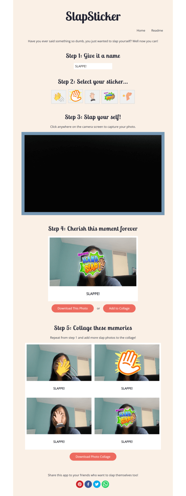

# SlapSticker  
SlapSticker is an app that lets users to slap stickers on their face, using their webcam. This repository is built to improve the original app for the purpose of Ambassadors' technical test.   
View the original repository [here](https://gitlab.com/AmbassadorsLab/react-dev-eval-2021)  
View the deployed website after improvements [here](https://dissyulina.github.io/slapsticker-react/)   

   

## Features and Functionalities  

### These are the basic / original functionalities:  

- User can give the captured image a title  
- User can pick a sticker  
- User can place the sticker over the webcam image  
- User can capture the webcam image with sticker  

### And these are the additional features I added to the app:  

- UI and UX improvement  
- User can choose a sticker (from multiple stickers)  
- User can download the captured image / photo  
- User can make a collage of multiple photos
- User can download the collage
- User can share the app to social media  
- App deployment so that user can access the URL directly  

    

## Quickstart  

- You can clone this repo to get started  
- run `$ npm install` to install deps  
- run `$ npm run start` to start dev environment  
- push it to github or gitlab to share it with us  

React libraries used:  
- [Create React App](https://create-react-app.dev/)  
    A tool to build cofigurations and setup needed for a React application.
- [Jss](https://cssinjs.org/?v=v10.9.0)  
   An authoring tool for CSS which allows you to use JavaScript to describe styles in a declarative, conflict-free and reusable way.
- [React Router](https://reactrouter.com/)  
   A page routing for React aplications.
- [React Share](https://github.com/nygardk/react-share)  
   A library to incorporate social media share buttons and share counts for React.
- [React Screenshot (with html2canvas as a dependency)](https://github.com/vre2h/use-react-screenshot)  
   A react hook which allows you to make component screenshot and get an image in different extensions.

   

## Credit  
Additional stickers were sourced from:
- `slap-cartoon.png` from [Pngtree](https://pngtree.com/element/down?id=NDU5NjY1Ng==&type=1&time=1648205516&token=Yjk5ODk1ZmQ1MjcxMGIwNDEzMDY4Y2UxNzg3OGIxNGI=)  
- `slap-fast.png` from [Pngtree](https://pngtree.com/freepng/fan-ear-light-cartoon-gesture_4596656.html)  
- `slap-orange.png` from [PngAAA](https://www.pngaaa.com/detail/2073428)  
- `slap-green.png` from [PngAAA](https://www.pngaaa.com/detail/2073514)  

   

# Original Create React App

## Getting Started with Create React App

This project was bootstrapped with [Create React App](https://github.com/facebook/create-react-app).

## Available Scripts

In the project directory, you can run:

### `npm start`

Runs the app in the development mode.\
Open [http://localhost:3000](http://localhost:3000) to view it in the browser.

The page will reload if you make edits.\
You will also see any lint errors in the console.

### `npm test`

Launches the test runner in the interactive watch mode.\
See the section about [running tests](https://facebook.github.io/create-react-app/docs/running-tests) for more information.

### `npm run build`

Builds the app for production to the `build` folder.\
It correctly bundles React in production mode and optimizes the build for the best performance.

The build is minified and the filenames include the hashes.\
Your app is ready to be deployed!

See the section about [deployment](https://facebook.github.io/create-react-app/docs/deployment) for more information.

### `npm run eject`

**Note: this is a one-way operation. Once you `eject`, you can’t go back!**

If you aren’t satisfied with the build tool and configuration choices, you can `eject` at any time. This command will remove the single build dependency from your project.

Instead, it will copy all the configuration files and the transitive dependencies (webpack, Babel, ESLint, etc) right into your project so you have full control over them. All of the commands except `eject` will still work, but they will point to the copied scripts so you can tweak them. At this point you’re on your own.

You don’t have to ever use `eject`. The curated feature set is suitable for small and middle deployments, and you shouldn’t feel obligated to use this feature. However we understand that this tool wouldn’t be useful if you couldn’t customize it when you are ready for it.

## Learn More

You can learn more in the [Create React App documentation](https://facebook.github.io/create-react-app/docs/getting-started).

To learn React, check out the [React documentation](https://reactjs.org/).

### Code Splitting

This section has moved here: [https://facebook.github.io/create-react-app/docs/code-splitting](https://facebook.github.io/create-react-app/docs/code-splitting)

### Analyzing the Bundle Size

This section has moved here: [https://facebook.github.io/create-react-app/docs/analyzing-the-bundle-size](https://facebook.github.io/create-react-app/docs/analyzing-the-bundle-size)

### Making a Progressive Web App

This section has moved here: [https://facebook.github.io/create-react-app/docs/making-a-progressive-web-app](https://facebook.github.io/create-react-app/docs/making-a-progressive-web-app)

### Advanced Configuration

This section has moved here: [https://facebook.github.io/create-react-app/docs/advanced-configuration](https://facebook.github.io/create-react-app/docs/advanced-configuration)

### Deployment

This section has moved here: [https://facebook.github.io/create-react-app/docs/deployment](https://facebook.github.io/create-react-app/docs/deployment)

### `npm run build` fails to minify

This section has moved here: [https://facebook.github.io/create-react-app/docs/troubleshooting#npm-run-build-fails-to-minify](https://facebook.github.io/create-react-app/docs/troubleshooting#npm-run-build-fails-to-minify)
